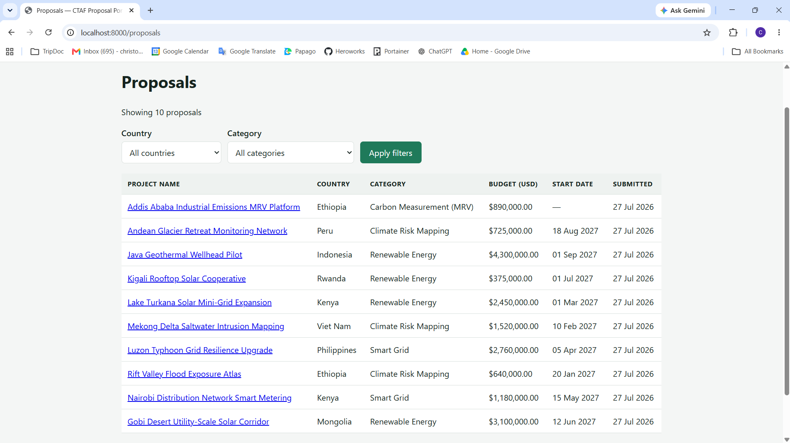

# CTAF Climate Technology Proposal Portal

A small web application for the Climate Technology Accelerator Fund
(CTAF): a structured intake form for climate technology project
proposals, validated and stored in Postgres, then browsed, filtered,
edited, and deleted. Built for assignment reference **INT_CTL015_E1**.

**Live demo:** [gggi-proposal-task.onrender.com](https://gggi-proposal-task.onrender.com)
*(hosted on Render's free tier — the instance spins down when idle, so
the first request after a while can take up to a minute to load)*



*The populated list page, taken after `docker compose up --build`.*

---

## Quick start (Docker)

The primary path. Requires only Docker.

```
git clone <this-repo-url>
cd GGGI_Proposal_Task
docker compose up --build
```

Then open **http://localhost:8000** — it redirects to the list page,
already showing ten seeded proposals. The interactive API browser is
at **http://localhost:8000/docs**.

The first build takes a couple of minutes (installing dependencies and
pulling the Postgres image). Every subsequent start is fast. Database
migrations and seeding run automatically on every start — there is no
manual `createdb` or `alembic upgrade` step, and seeding is idempotent,
so restarting the stack never duplicates the ten example proposals.

To stop everything: `docker compose down`. To also delete the stored
data and start completely fresh: `docker compose down -v`.

## Running without Docker

For a reader who already has a Postgres server reachable.

```
python -m venv .venv
.venv\Scripts\activate        # or: source .venv/bin/activate on macOS/Linux
pip install -r requirements.txt
sh scripts/entrypoint.sh
```

That script runs the same three steps Docker runs: it creates the
`ctaf` database if the server doesn't already have one, applies
migrations, seeds ten example proposals (set `SEED_ON_START=true` to
enable seeding outside Docker), and starts the server on port 8000.
Equivalently, run the three commands it contains yourself:

```
python -c "from app.config import get_settings; from app.db.bootstrap import ensure_database_exists; ensure_database_exists(get_settings().database_url)"
alembic upgrade head
uvicorn app.main:app --reload
```

No `.env` file is required unless your Postgres credentials differ
from the defaults (`ctaf` / `ctaf` on `localhost:5432`) — copy
`.env.example` to `.env` and adjust if so. Postgres itself is required
either way; this application does not support any other storage
backend (see *Design decisions* below for why).

## Running the tests

```
pytest -q
```

The test database (`ctaf_test`) creates itself on first run, the same
way the application database does — the only prerequisite is a
reachable Postgres server. Each test runs inside its own transaction,
rolled back afterwards, so tests never see each other's rows.

---

## How it is put together

The application is one Python program (FastAPI, served by Uvicorn)
next to Postgres, a separate program that stores the data. Inside the
Python program, the code is split into five layers, each of which
talks only to the layer directly beneath it:

| Layer | Its one job |
|---|---|
| Templates | Turn a list of proposals into the HTML page a person sees |
| Routes | Receive a request, call one service function, return a page or redirect |
| Schemas | Check that incoming data is valid and convert it to real types |
| Services | Apply the rules about proposals (e.g. no two live proposals share a name) |
| Repository | Read and write the database |

A read-only JSON API sits beside the server-rendered pages, reaching
the identical service and repository calls — see *A JSON API alongside
the pages* below.

**Routes:**

| URL | Method | Purpose |
|---|---|---|
| `/` | GET | Redirects to `/proposals` |
| `/health` | GET | Liveness probe |
| `/proposals` | GET | List, optionally filtered by `country` and/or `category` |
| `/proposals/new` | GET | Empty submission form |
| `/proposals` | POST | Validate and create |
| `/proposals/{id}` | GET | Detail view |
| `/proposals/{id}/edit` | GET | Form, pre-filled |
| `/proposals/{id}` | POST | Validate and save an edit |
| `/proposals/{id}/delete` | POST | Soft delete |
| `/api/proposals` | GET | List as JSON, optionally filtered |
| `/api/proposals/{id}` | GET | One proposal as JSON |
| `/api/countries` | GET | The 54 GGGI member countries as JSON |
| `/docs` | GET | Interactive API documentation |

For the full component diagram, the request-by-request walkthroughs of
every flow (submit, filter, edit, delete), and the reasoning behind
every non-obvious decision, see
[`docs/architecture-and-implementation-plan.md`](docs/architecture-and-implementation-plan.md) —
the design specification this application was built from.

---

## Design decisions

**Proposals are shared, not per-user.** The assignment mentions no
accounts or logins and asks for *all* submitted proposals to be
displayed, so the app treats proposals as one shared collection, as
would suit an internal review team. A nullable `owner_id` column
exists so per-user scoping could be added later without rebuilding the
table.

**The country list is data, not code.** All 54 GGGI member states are
curated from the Institute's official listing of 12 March 2026 into
`app/domain/data/gggi_members.txt`, read through one cached loader.
GGGI admits new members several times a year, so the list does not
belong hard-coded; the loader is the seam that lets it move into a
database table later without any caller changing. *Verifying the list
is current*: the file's header records the source URL and the edition
date it was curated from — compare a fresh listing from `gggi.org`
against the file, which is kept in accession order specifically so new
members append at the end and a diff is a single line.

**Deletes are soft.** Records are marked deleted (`deleted_at` is set)
rather than removed, so an accidental deletion is recoverable and
there is a record of what happened.

**Validation happens twice, on purpose.** Browser attributes
(`required`, `min`, `maxlength`) give fast feedback to someone using
the form normally. A Pydantic schema on the server re-checks every
rule regardless, because anything enforced only in the browser can be
disabled from developer tools or skipped entirely by a request sent
from the command line.

**Postgres rather than a JSON file.** A file breaks when two people
submit at the same time, can't be queried for filtering, and enforces
no types. Postgres handles all three.

**A JSON API alongside the pages.** It exists so a React (or any
other) frontend could be added later without first having to
disentangle business logic from page-rendering code — the endpoints
are the seam such a frontend would plug into. That the second door
cost only a few dozen lines is also the observable evidence that the
layering above is real, rather than merely claimed.

**Money is `NUMERIC`, not a float.** Binary floating point stores
decimal fractions like 0.1 approximately, and the error compounds
across arithmetic; budgets must be exact.

**No inline event handlers.** Jinja's autoescaping protects HTML text
contexts, but an `onsubmit` or `onclick` attribute is a *JavaScript*
context, where HTML escaping does not protect anything — the HTML
parser decodes entities before the script is parsed. Values a script
needs travel as `data-` attributes and are read with `getAttribute()`,
so a proposal name is always handled as data, never as code.

**Development credentials are in `docker-compose.yml` in plain text**
(`ctaf` / `ctaf`), reaching a throwaway local container. Nothing here
is deployed anywhere that a hard-coded development password could
reach.

---

## What I would add with more time

Pagination on the list page, user accounts with per-proposal
ownership (the nullable `owner_id` column exists for exactly this), a
partial unique index backstopping the application-level uniqueness
check against a race between two simultaneous submissions, and a
proper error-tracking setup. The full list, each with an estimate of
the work involved, is in
[§7 of the architecture document](docs/architecture-and-implementation-plan.md#7-future-works-and-potential-add-ons).

## AI-prompt usage note

This project was built with AI assistance. See
[`docs/AI_PROMPTS.md`](docs/AI_PROMPTS.md) for the required note on
which prompts were used and how the output was treated.
